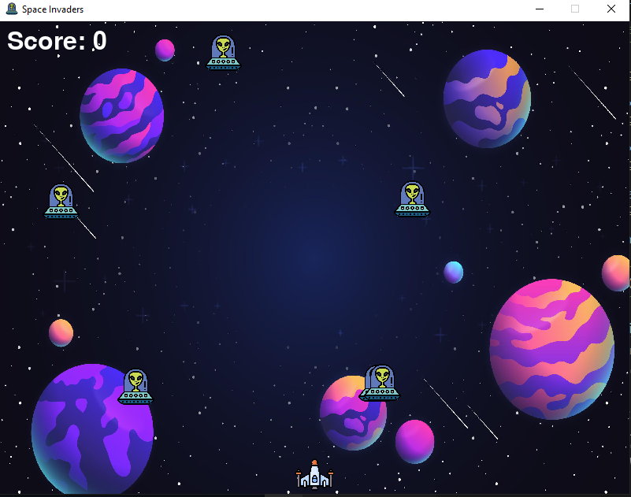

# SpaceInvaders
A Space Invaders clone using Python and the Pygame library

## Table of contents

- [Overview](#overview)
  - [The challenge](#the-challenge)
  - [Screenshot](#screenshot)
  - [Instructions](#instructions)
- [My process](#my-process)
  - [Built with](#built-with)
  - [What I learned](#what-i-learned)
- [Author](#author)

## Overview

### The challenge

Users should be able to:

- Play one round of Space Invaders and get the score immediately after hitting an enemy with a bullet. The game should show Game Over after an alien reaches the bottom of the game window or crashes with the spaceship.

### Screenshot

### Instructions

Clone the directory. Open a command-line, terminal tab or CMD within the directory you just cloned and run `python space_invaders.py`.

Use the arrow keys to move the ship and press the space key to shoot a bullet. Beware of crashing into an alien ship.

## My process

### Built with

- Pygame library to handle the animations and sound effects
- Python for the game logic

### What I learned

Working with Python modules to create a 2D application. This allowed me to know how desktop applications work at a basic level and opened my mind to create things that are not restrained to a command-line interface.

## Author

- Frontend Mentor - [@dnewbie25](https://www.frontendmentor.io/profile/dnewbie25)
- DevChallenges - [dnewbie25](https://devchallenges.io/portfolio/dnewbie25)